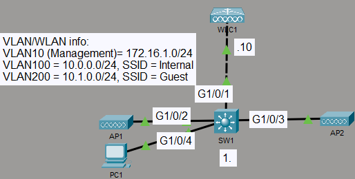
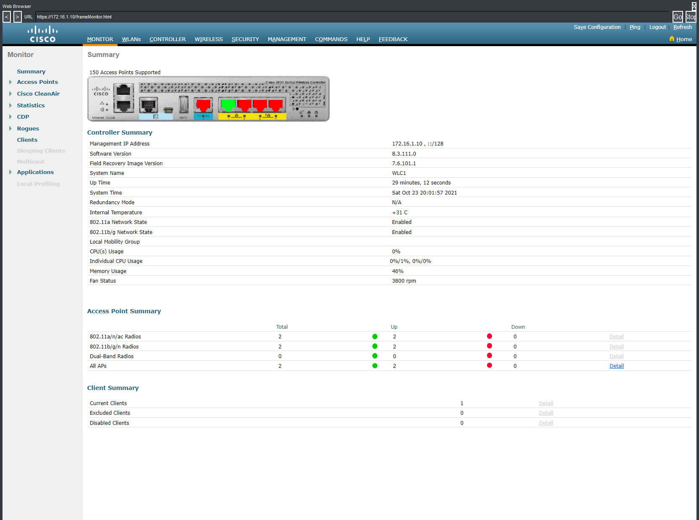
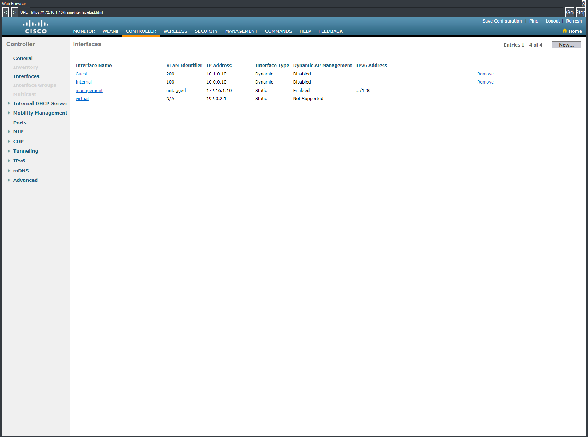
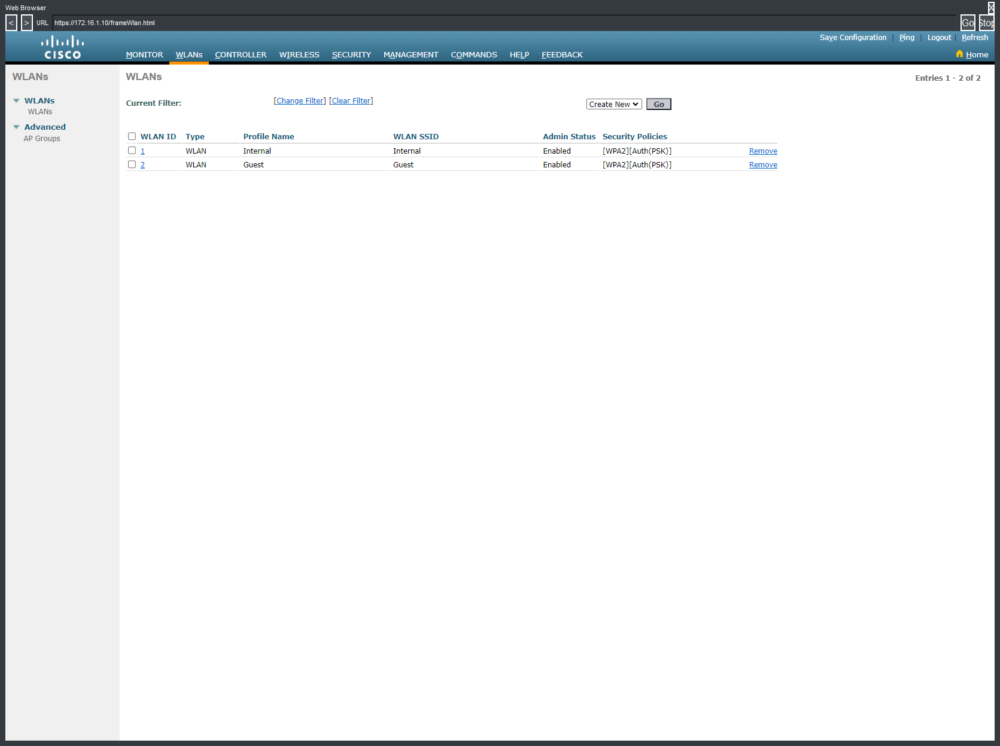
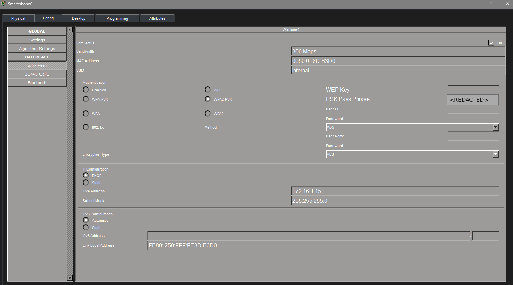

# WLC WLAN Configuration

## Objective

I used the WLC1 HTTPS GUI to configure two WLANs: **Internal** and **Guest**. I mapped them to separate dynamic interfaces for VLAN 100 and VLAN 200, applied WPA2-PSK security, and associated a wireless client with the Internal WLAN.

The switch configuration, WLC management connectivity, and AP infrastructure were preconfigured. My work in this lab was focused on WLC GUI configuration and verification.

## Topology

- Management: VLAN 10 — `172.16.1.0/24`
- Internal: VLAN 100 — `10.0.0.0/24`
- Guest: VLAN 200 — `10.1.0.0/24`

## Concepts

- Cisco Wireless LAN Controller administration over HTTPS
- Dynamic interfaces and VLAN mapping
- WLAN and SSID configuration
- WPA2-PSK wireless security
- Access point status and wireless client association

## Configuration Highlights

- Accessed WLC1 through its management address `172.16.1.10` using HTTPS.
- Created the **Internal** dynamic interface on VLAN 100 with IP address `10.0.0.10`.
- Created the **Guest** dynamic interface on VLAN 200 with IP address `10.1.0.10`.
- Created and enabled the **Internal** and **Guest** WLANs with WPA2-PSK authentication.
- Connected a smartphone wireless client to the **Internal** SSID.

## Verification Evidence

### WLC Summary

WLC1 shows both access points up and one current wireless client, confirming that the controller and AP infrastructure are operational and that a client is associated.

### Dynamic Interfaces

The controller shows **Internal** mapped to VLAN 100 at `10.0.0.10` and **Guest** mapped to VLAN 200 at `10.1.0.10`. The preconfigured management interface remains available at `172.16.1.10`.

### WLANs

Both **Internal** and **Guest** WLANs are enabled and use WPA2 with pre-shared-key authentication.

### Wireless Client

The smartphone is configured for the **Internal** SSID using WPA2-PSK. The pre-shared key is redacted in the portfolio image.

## Packet Tracer Note

Packet Tracer assigned the wireless client `172.16.1.15/24` in this simulation instead of an address from the Internal subnet. I am not treating that address assignment as validated VLAN 100 DHCP behavior; the evidence here verifies the WLC GUI configuration and the wireless client association required by the lab.

## Result

The Internal and Guest WLANs were created and enabled on WLC1 with separate dynamic interface mappings and WPA2-PSK security. Both APs remained up, and the wireless client associated with the Internal WLAN.
